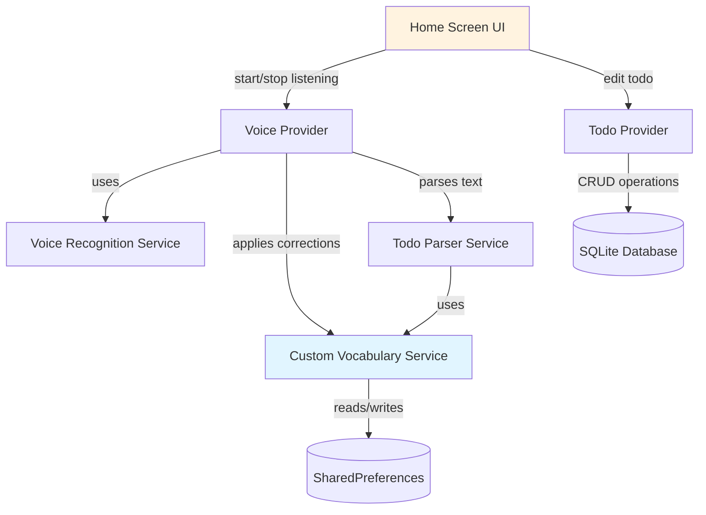
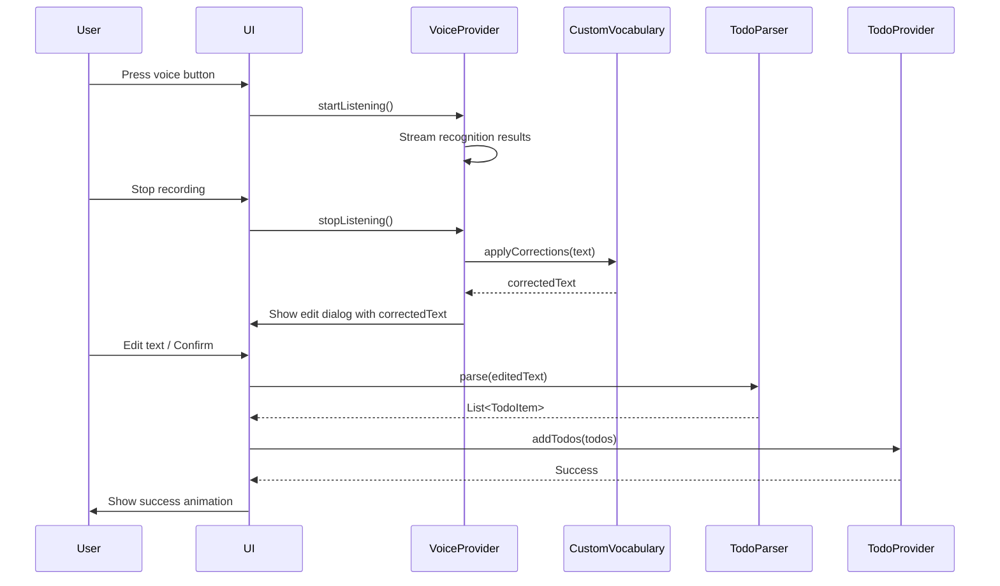

# Design Document: Voice Recognition Enhancement

## Overview

This design enhances the VoiceTodo app with improved voice recognition accuracy, post-recognition editing, todo item editing, Material Design 3 styling, and smooth animations. The solution introduces a custom vocabulary system for grocery items, an editable confirmation dialog after voice recognition, a comprehensive todo editing interface, and modern UI components with fluid animations.

### Key Design Decisions

1. **Custom Vocabulary Architecture**: Implement a fuzzy-matching dictionary service that corrects common misrecognitions before parsing, stored in SharedPreferences for persistence
2. **Two-Stage Editing Flow**: Separate post-recognition editing (before todo creation) from post-creation editing (after todo is saved) to provide flexibility at both stages
3. **Material Design 3 Components**: Leverage Flutter's Material 3 widgets (FilledButton, Card with elevation, BottomSheet) with dynamic color schemes
4. **Implicit Animations**: Use AnimatedContainer, AnimatedOpacity, and SlideTransition for smooth, performant transitions without complex animation controllers
5. **Provider Pattern Consistency**: Extend existing VoiceProvider and TodoProvider to manage new editing states without architectural changes

## Architecture

### High-Level Component Diagram



### Data Flow for Voice Recognition with Editing



## Components and Interfaces

### 1. Custom Vocabulary Service

**Purpose**: Manages a dictionary of commonly misrecognized words and applies fuzzy-matching corrections to voice recognition results.

**Interface**:
```dart
class CustomVocabularyService {
  static final CustomVocabularyService instance;
  
  // Load vocabulary from SharedPreferences
  Future<void> initialize();
  
  // Apply corrections to recognized text
  String applyCorrections(String text);
  
  // Add a new vocabulary entry
  Future<void> addEntry(String incorrect, String correct);
  
  // Remove a vocabulary entry
  Future<void> removeEntry(String incorrect);
  
  // Get all vocabulary entries
  Map<String, String> getAllEntries();
  
  // Import default grocery vocabulary
  Future<void> loadDefaultGroceryVocabulary();
}
```

**Implementation Details**:
- Uses `fuzzywuzzy` or `string_similarity` package for fuzzy matching (threshold: 0.8)
- Stores vocabulary as JSON in SharedPreferences with key `custom_vocabulary`
- Default vocabulary includes 50+ Chinese grocery items:
  - Vegetables: 白菜, 西红柿, 黄瓜, 茄子, 土豆, 胡萝卜, 青椒, 洋葱, 大蒜, 生姜, etc.
  - Fruits: 苹果, 香蕉, 橙子, 葡萄, 西瓜, 草莓, 芒果, 梨, 桃子, 樱桃, etc.
  - Units: 筐, 把, 斤, 两, 公斤, 克, 个, 袋, 盒, 瓶, etc.
- Correction algorithm:
  1. Split text into words/phrases
  2. For each word, check exact match in vocabulary
  3. If no exact match, use fuzzy matching with threshold 0.8
  4. Replace with correct term if match found
  5. Preserve original if no match

### 2. Recognition Result Edit Dialog

**Purpose**: Displays an editable text field after voice recognition completes, allowing users to correct errors before creating todos.

**Interface**:
```dart
class RecognitionEditDialog extends StatefulWidget {
  final String initialText;
  final Function(String) onConfirm;
  final VoidCallback onCancel;
  
  const RecognitionEditDialog({
    required this.initialText,
    required this.onConfirm,
    required this.onCancel,
  });
}
```

**UI Components**:
- Material 3 BottomSheet with rounded top corners (16dp radius)
- Large text field (4 lines minimum) with Material 3 OutlinedTextField styling
- Two action buttons:
  - FilledButton for "确认" (Confirm) - primary color
  - TextButton for "取消" (Cancel) - on-surface color
- Character count indicator (optional)
- Keyboard automatically focused on text field

**Animation**:
- Slide up from bottom with 300ms duration
- Fade in backdrop with 200ms duration
- Scale animation on confirm button press (0.95 scale)

### 3. Todo Item Edit Dialog

**Purpose**: Provides a comprehensive editing interface for existing todo items with all properties editable.

**Interface**:
```dart
class TodoEditDialog extends StatefulWidget {
  final TodoItem todo;
  final Function(TodoItem) onSave;
  final VoidCallback onCancel;
  
  const TodoEditDialog({
    required this.todo,
    required this.onSave,
    required this.onCancel,
  });
}
```

**UI Components**:
- Material 3 Dialog with elevated Card (elevation: 3)
- Form fields:
  - Title: OutlinedTextField with validation (required, max 100 chars)
  - Description: OutlinedTextField multiline (optional, max 500 chars)
  - Category: DropdownMenu with predefined categories + custom option
  - Priority: SegmentedButton with 3 options (高/中/低)
  - Deadline: DateTimePicker with Material 3 styling
- Action buttons:
  - FilledButton for "保存" (Save)
  - TextButton for "取消" (Cancel)
- Form validation with inline error messages

**Animation**:
- Scale and fade in (from 0.8 to 1.0 scale, 250ms)
- Slide in from center with overshoot effect
- Ripple effect on save button

### 4. Enhanced Voice Provider

**Purpose**: Extends existing VoiceProvider to integrate custom vocabulary corrections and manage editing state.

**New Methods**:
```dart
class VoiceProvider extends ChangeNotifier {
  // Existing methods...
  
  // New: Apply vocabulary corrections after recognition
  Future<String> _applyVocabularyCorrections(String text);
  
  // New: Show edit dialog and wait for user confirmation
  Future<String?> showRecognitionEditDialog(BuildContext context);
  
  // New: Get corrected text without parsing
  String getCorrectedText();
}
```

**State Changes**:
- Add `_correctedText` field to store vocabulary-corrected text
- Add `_isEditingRecognition` boolean to track edit dialog state
- Modify `stopListening()` to apply corrections before showing edit dialog

### 5. Enhanced Todo Provider

**Purpose**: Extends existing TodoProvider to support in-place editing of todo items.

**New Methods**:
```dart
class TodoProvider extends ChangeNotifier {
  // Existing methods...
  
  // New: Update todo with validation
  Future<void> updateTodoWithValidation(TodoItem updatedTodo);
  
  // New: Show edit dialog for a todo
  Future<void> showTodoEditDialog(BuildContext context, TodoItem todo);
}
```

### 6. Material Design 3 Theme Configuration

**Purpose**: Defines app-wide Material 3 color scheme, typography, and component themes.

**Implementation**:
```dart
class AppTheme {
  static ThemeData lightTheme() {
    final ColorScheme colorScheme = ColorScheme.fromSeed(
      seedColor: Colors.blue,
      brightness: Brightness.light,
    );
    
    return ThemeData(
      useMaterial3: true,
      colorScheme: colorScheme,
      typography: Typography.material2021(),
      cardTheme: CardTheme(
        elevation: 2,
        shape: RoundedRectangleBorder(
          borderRadius: BorderRadius.circular(12),
        ),
      ),
      filledButtonTheme: FilledButtonThemeData(
        style: FilledButton.styleFrom(
          minimumSize: Size(88, 48),
          shape: RoundedRectangleBorder(
            borderRadius: BorderRadius.circular(12),
          ),
        ),
      ),
      // ... more component themes
    );
  }
  
  static ThemeData darkTheme() {
    // Similar structure with dark color scheme
  }
}
```

### 7. Animation Utilities

**Purpose**: Provides reusable animation widgets and constants for consistent motion design.

**Components**:
```dart
class AnimationConstants {
  static const Duration fast = Duration(milliseconds: 200);
  static const Duration normal = Duration(milliseconds: 300);
  static const Duration slow = Duration(milliseconds: 400);
  
  static const Curve easeInOut = Curves.easeInOut;
  static const Curve overshoot = Curves.easeOutBack;
}

class AnimatedListItem extends StatelessWidget {
  final Widget child;
  final int index;
  final Animation<double> animation;
  
  // Slide and fade animation for list items
}

class ScaleTransitionButton extends StatelessWidget {
  final Widget child;
  final VoidCallback onPressed;
  
  // Scale down on press, scale up on release
}
```

## Data Models

### Custom Vocabulary Entry

```dart
class VocabularyEntry {
  final String incorrect;  // Misrecognized term
  final String correct;    // Correct term
  final int usageCount;    // How many times this correction was applied
  final DateTime createdAt;
  
  VocabularyEntry({
    required this.incorrect,
    required this.correct,
    this.usageCount = 0,
    required this.createdAt,
  });
  
  Map<String, dynamic> toJson();
  factory VocabularyEntry.fromJson(Map<String, dynamic> json);
  
  VocabularyEntry incrementUsage();
}
```

### Enhanced TodoItem (No Changes)

The existing `TodoItem` model already supports all required fields. No modifications needed.

### Edit State Model

```dart
class EditState {
  final bool isEditing;
  final TodoItem? editingTodo;
  final String? editingText;
  
  EditState({
    this.isEditing = false,
    this.editingTodo,
    this.editingText,
  });
  
  EditState copyWith({
    bool? isEditing,
    TodoItem? editingTodo,
    String? editingText,
  });
}
```

## Correctness Properties

*A property is a characteristic or behavior that should hold true across all valid executions of a system—essentially, a formal statement about what the system should do. Properties serve as the bridge between human-readable specifications and machine-verifiable correctness guarantees.*


### Property 1: Vocabulary Storage Round-Trip

*For any* vocabulary entry with an incorrect term and correct term, storing the entry and then retrieving all entries should include an entry with matching incorrect and correct terms.

**Validates: Requirements 1.1**

### Property 2: Vocabulary Corrections Applied Before Parsing

*For any* recognition result containing a known misrecognized term, applying vocabulary corrections should replace the misrecognized term with the correct term before the text is parsed into todos.

**Validates: Requirements 1.2, 6.1**

### Property 3: Vocabulary Persistence Immediacy

*For any* vocabulary entry or modification, the change should be immediately retrievable from local storage without requiring an app restart or explicit save action.

**Validates: Requirements 1.4, 7.2**

### Property 4: Recognition Edit Confirmation Creates Todos

*For any* valid edited recognition text, clicking "Confirm" in the edit dialog should result in one or more todo items being created with titles derived from the edited text.

**Validates: Requirements 2.5**

### Property 5: Recognition Edit Cancellation Resets State

*For any* recognition result, clicking "Cancel" in the edit dialog should discard the recognition result and return the voice provider to the ready state without creating any todos.

**Validates: Requirements 2.6**

### Property 6: Todo Edit Dialog Shows All Properties

*For any* todo item, tapping on it should display an edit dialog containing editable fields for title, category, priority, and deadline with values matching the original todo.

**Validates: Requirements 3.1**

### Property 7: Invalid Todo Edits Are Rejected

*For any* todo edit with invalid input (empty title, invalid date format, etc.), attempting to save should display an error message and prevent the save operation.

**Validates: Requirements 3.3, 8.4**

### Property 8: Todo Edit Round-Trip Preserves Data

*For any* todo item and valid property changes, editing the todo, saving the changes, and then retrieving the todo from the database should return a todo with the updated properties and the original creation timestamp.

**Validates: Requirements 3.4, 3.6, 7.4**

### Property 9: Todo Edit Cancellation Preserves Original

*For any* todo item, making edits in the edit dialog and then clicking "Cancel" should result in the todo remaining unchanged in both the database and UI.

**Validates: Requirements 3.5**

### Property 10: Fuzzy Vocabulary Matching

*For any* word in the recognition result that is similar (edit distance ≤ 2 or similarity score ≥ 0.8) to a vocabulary entry, the fuzzy matching algorithm should identify the vocabulary entry as a potential match.

**Validates: Requirements 6.2**

### Property 11: Highest Confidence Match Selected

*For any* recognition word with multiple vocabulary matches, the system should select and apply the vocabulary entry with the highest confidence score.

**Validates: Requirements 6.3**

### Property 12: Database Update Performance

*For any* todo item edit, the database update operation should complete within 100ms from the time the save button is pressed.

**Validates: Requirements 7.1**

### Property 13: Database Failure Preserves State

*For any* database write operation that fails, the system should display an error message and the UI state should match the database state (no phantom updates).

**Validates: Requirements 7.3**

### Property 14: Animation Duration Bounds

*For any* UI animation (dialog open/close, list item add/remove, completion checkmark), the animation duration should be between 200ms and 400ms inclusive.

**Validates: Requirements 5.5**

### Property 15: Reduced Motion Respected

*For any* animation, when the system's reduced motion accessibility setting is enabled, the animation should either be disabled or use a duration of 0ms.

**Validates: Requirements 5.7**

### Property 16: Invalid Vocabulary Entries Skipped

*For any* vocabulary entry with invalid format (null values, empty strings, malformed JSON), the system should skip the entry during correction processing and log a warning without crashing.

**Validates: Requirements 8.5**

### Property 17: Touch Target Minimum Size

*For any* interactive button or tappable element, the touch target size should be at least 48x48 dp to meet accessibility guidelines.

**Validates: Requirements 9.2**

### Property 18: Color Contrast Compliance

*For any* text element on a background, the color contrast ratio should meet WCAG AA standards (4.5:1 for normal text, 3:1 for large text and UI components).

**Validates: Requirements 9.3**

### Property 19: Edit Dialog Display Performance

*For any* request to open the edit dialog (recognition or todo edit), the dialog should be fully displayed and interactive within 100ms.

**Validates: Requirements 10.1**

### Property 20: Vocabulary Correction Performance

*For any* recognition result text, applying custom vocabulary corrections should complete within 50ms regardless of vocabulary size (up to 1000 entries).

**Validates: Requirements 10.2**

## Error Handling

### Voice Recognition Errors

**Error Types**:
1. **Permission Denied**: User denies microphone permission
2. **Device Unsupported**: Device doesn't support speech recognition
3. **Recognition Failed**: Speech recognition service fails
4. **No Speech Detected**: User doesn't speak during recording
5. **Network Error**: Speech recognition service requires network but it's unavailable

**Handling Strategy**:
- Display user-friendly error messages in Chinese
- Provide actionable suggestions (e.g., "请检查麦克风权限")
- Log errors for debugging without exposing technical details to users
- Gracefully degrade to manual text input if voice recognition fails repeatedly
- Show permission dialogs with clear explanations before requesting permissions

### Database Errors

**Error Types**:
1. **Write Failure**: SQLite write operation fails
2. **Read Failure**: SQLite read operation fails
3. **Constraint Violation**: Unique constraint or foreign key violation
4. **Disk Full**: Device storage is full

**Handling Strategy**:
- Display snackbar with error message and retry option
- Preserve UI state to prevent data loss
- Implement optimistic UI updates with rollback on failure
- Log errors with stack traces for debugging
- Provide "Clear Cache" option if disk is full

### Validation Errors

**Error Types**:
1. **Empty Title**: User tries to save todo with empty title
2. **Invalid Date**: User enters invalid deadline date
3. **Invalid Vocabulary Entry**: Malformed vocabulary entry

**Handling Strategy**:
- Show inline error messages below form fields
- Disable save button until all validation passes
- Highlight invalid fields with red border
- Provide clear error messages in Chinese (e.g., "标题不能为空")
- Prevent form submission with invalid data

### Network Errors

**Error Types**:
1. **No Connection**: Device has no internet connection
2. **Timeout**: Network request times out
3. **Server Error**: Remote service returns error

**Handling Strategy**:
- Gracefully degrade to offline mode
- Cache data locally and sync when connection restored
- Show offline indicator in UI
- Disable network-dependent features with explanation
- Provide manual retry option

## Testing Strategy

### Dual Testing Approach

This feature requires both **unit tests** and **property-based tests** for comprehensive coverage:

- **Unit tests**: Verify specific examples, edge cases, UI interactions, and error conditions
- **Property tests**: Verify universal properties across all inputs using randomized testing

### Property-Based Testing Configuration

**Library**: Use `flutter_test` with custom property test helpers or integrate `test_api` with property generators

**Configuration**:
- Minimum 100 iterations per property test
- Each property test must reference its design document property
- Tag format: `@Tags(['Feature: voice-recognition-enhancement', 'Property N: {property_text}'])`

**Property Test Examples**:

```dart
// Property 1: Vocabulary Storage Round-Trip
@Tags(['Feature: voice-recognition-enhancement', 'Property 1: Vocabulary Storage Round-Trip'])
test('vocabulary storage round-trip', () async {
  final service = CustomVocabularyService.instance;
  
  for (int i = 0; i < 100; i++) {
    final incorrect = generateRandomChineseWord();
    final correct = generateRandomChineseWord();
    
    await service.addEntry(incorrect, correct);
    final entries = service.getAllEntries();
    
    expect(entries[incorrect], equals(correct));
  }
});

// Property 8: Todo Edit Round-Trip Preserves Data
@Tags(['Feature: voice-recognition-enhancement', 'Property 8: Todo Edit Round-Trip'])
test('todo edit round-trip preserves data', () async {
  final provider = TodoProvider();
  
  for (int i = 0; i < 100; i++) {
    final originalTodo = generateRandomTodo();
    await provider.addTodo(originalTodo);
    
    final newTitle = generateRandomString();
    final newCategory = generateRandomCategory();
    final updatedTodo = originalTodo.copyWith(
      title: newTitle,
      category: newCategory,
    );
    
    await provider.updateTodoWithValidation(updatedTodo);
    final retrieved = await provider.getTodoById(originalTodo.id);
    
    expect(retrieved.title, equals(newTitle));
    expect(retrieved.category, equals(newCategory));
    expect(retrieved.createdAt, equals(originalTodo.createdAt));
  }
});
```

### Unit Testing Focus Areas

**Specific Examples**:
- Default vocabulary contains exactly 50+ entries
- Edit dialog displays with correct initial text
- Confirm and Cancel buttons are present in dialog
- Light and dark themes can be switched
- Recognition accuracy metrics are logged

**Edge Cases**:
- Empty recognition result
- Recognition result with only whitespace
- Todo with null deadline
- Vocabulary entry with special characters
- Very long todo titles (>100 characters)

**Integration Points**:
- Voice provider integrates with custom vocabulary service
- Todo provider integrates with SQLite service
- Edit dialogs integrate with providers
- Animations integrate with theme

**Error Conditions**:
- Voice recognition permission denied
- Database write failure
- Invalid form input
- Network unavailable
- Device unsupported

### Test Coverage Goals

- **Unit test coverage**: 80% of code lines
- **Property test coverage**: All 20 correctness properties implemented
- **Integration test coverage**: All critical user flows (voice → edit → save, tap → edit → save)
- **Widget test coverage**: All custom dialogs and UI components
- **Performance test coverage**: All timing requirements (100ms, 50ms, 200-400ms)

### Testing Tools

- **flutter_test**: Core testing framework
- **mockito**: Mocking dependencies (SQLite, SharedPreferences)
- **integration_test**: End-to-end user flow testing
- **golden_toolkit**: Visual regression testing for Material Design 3 components
- **flutter_driver**: Performance testing for animations and timing

### Continuous Integration

- Run all tests on every commit
- Fail build if any property test fails
- Generate coverage reports
- Run performance tests on physical devices
- Test on both Android and iOS platforms
- Test with both light and dark themes
- Test with reduced motion enabled

## Implementation Notes

### Phase 1: Custom Vocabulary Service (Foundation)

1. Implement `CustomVocabularyService` with SharedPreferences storage
2. Add default grocery vocabulary (50+ items)
3. Implement fuzzy matching algorithm with threshold 0.8
4. Add vocabulary management UI in settings
5. Write property tests for vocabulary storage and correction

### Phase 2: Post-Recognition Editing

1. Create `RecognitionEditDialog` widget with Material 3 styling
2. Integrate dialog into `VoiceProvider.stopListening()` flow
3. Add vocabulary correction before showing dialog
4. Implement confirm/cancel actions
5. Write property tests for edit confirmation and cancellation

### Phase 3: Todo Item Editing

1. Create `TodoEditDialog` widget with form validation
2. Add tap handler to todo list items
3. Implement `TodoProvider.updateTodoWithValidation()`
4. Add inline validation error messages
5. Write property tests for edit round-trip and validation

### Phase 4: Material Design 3 Styling

1. Create `AppTheme` with light and dark color schemes
2. Apply Material 3 components throughout app
3. Update all buttons to FilledButton/TextButton
4. Update all cards with proper elevation
5. Test theme switching and color contrast

### Phase 5: Animation Implementation

1. Create `AnimationConstants` utility class
2. Implement `AnimatedListItem` for todo list
3. Add dialog open/close animations
4. Add completion checkmark animation
5. Implement reduced motion support
6. Write property tests for animation timing

### Phase 6: Performance Optimization

1. Add performance monitoring for database operations
2. Optimize vocabulary correction algorithm
3. Implement lazy loading for large todo lists
4. Profile memory usage
5. Write performance tests for timing requirements

### Dependencies

**New Packages**:
- `string_similarity: ^2.0.0` - For fuzzy matching in vocabulary corrections
- `shared_preferences: ^2.2.0` - Already used, for vocabulary storage

**Existing Packages** (no changes):
- `speech_to_text` - Voice recognition
- `sqflite` - Database
- `provider` - State management
- `flutter_local_notifications` - Reminders

### Migration Considerations

- Existing todos are not affected (no schema changes)
- Custom vocabulary starts empty (user builds it over time)
- Default vocabulary is loaded on first app launch
- Existing voice recognition flow is enhanced, not replaced
- All existing tests should continue to pass

### Accessibility Considerations

- All interactive elements have semantic labels
- Minimum touch target size of 48x48 dp
- Color contrast ratios meet WCAG AA standards
- Support for system text scaling
- Reduced motion support for animations
- Screen reader announcements for state changes
- Keyboard navigation support (for external keyboards)

### Localization

- All UI text in Chinese (existing pattern)
- Error messages in Chinese
- Voice recognition locale set to `zh_CN`
- Date/time formatting follows Chinese conventions
- Number formatting follows Chinese conventions

### Security Considerations

- Custom vocabulary stored locally (no cloud sync)
- No sensitive data in vocabulary entries
- SQLite database encrypted at rest (platform default)
- No network requests for vocabulary (fully offline)
- Permissions requested with clear explanations

## Future Enhancements

1. **Cloud Sync**: Sync custom vocabulary across devices
2. **Smart Suggestions**: Suggest vocabulary entries based on frequent corrections
3. **Voice Training**: Allow users to train recognition for specific words
4. **Batch Editing**: Edit multiple todos at once
5. **Undo/Redo**: Undo recent edits and deletions
6. **Export/Import**: Export vocabulary and todos to JSON
7. **Voice Commands**: Support voice commands like "delete all completed"
8. **Collaborative Vocabulary**: Share vocabulary entries with other users
